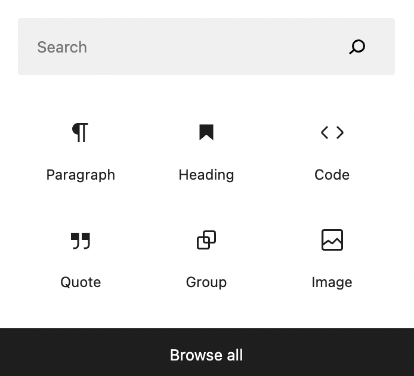
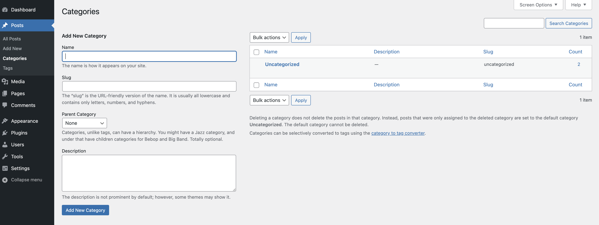
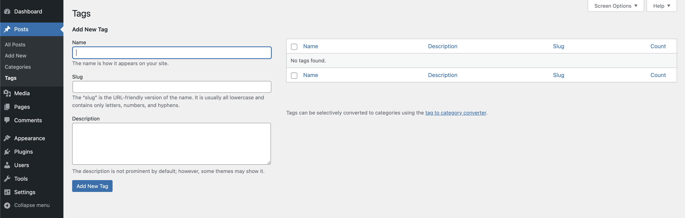
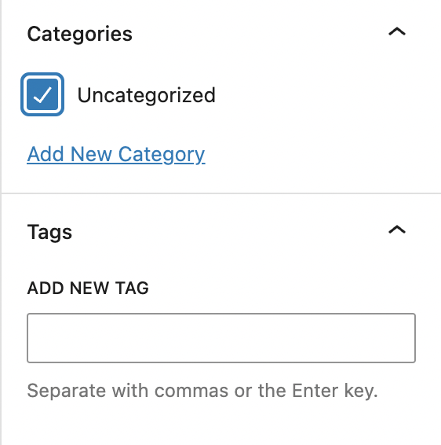

# Blog Post 3: Creating & Publishing Content on a Content Management System
### By: Holly Rossmann
<br>
This blog post will act as a tutorial for those using a content management system for the first time. In particular, it will discuss how to implement post tags and categories, as well as utilizing code highlighting. Examples will be shown specifically for a WordPress application - while the same general principles will be the same for any CMS, exact steps may vary.

<br>

*(This was done on a Mac - the success of some steps below may vary for users of a different OS.)*

<br> 

> ## Tools:
> * Access to a terminal (Default Mac Terminal)
> * Access to a Content Management System that hosts your website (WordPress)

<br>

# Why use a CMS?

One main draw for people to use WordPress (or another CMS) is the ease of creating and publishing their own blog posts. For those who have their own website, blog posts can be used as a way to product news, answer FAQs, or helpful tips and tricks. Using WordPress, it is extremely easy to quickly type and post your content. While the process itself is very simple, it can be confusing to understand all the features it offers as a first time user. 

That is why this post will walk through three beneficial WordPress features, and how you can implement them on your own site.

<br>

# Code Highlighting
Code Highlighting is a great way for you to easily integrate code into your blog posts. With unique text colors, and fonts, code highlighting easily makes the code stand out to your readers.

For WordPress, this can be accessed by selecting the code block within the <a href="https://www.wpbeginner.com/beginners-guide/how-to-use-the-new-wordpress-block-editor/" target="_blank">Block Editor</a>. Once you have the code block selected, you can feel free to type or copy/paste a code snippet. 

When you go to publish your post, your readers will now be able easily view the code, since it will stand out in your articles.

The demo below is an example on how a code snippet will look like on your site. 

<br>

```
<h1>
  Hello World!
</h1>
```

<br>

When creating a new blog post, you can insert a code block by navigating to the editor and clicking the plus button to add a new block. When the option menu appear, chose the block designated with the <strong><></strong> symbol, as seen below.

<br>



# Categories

Tags and categories are very important, and often used to organize your content. Categories group your posts by broad topics, making it easy for readers to find related content on your website. They are also hierarchical, which allows you to create subcategories. 

Categories use this hierarchy to designate how the specific URL of a blog posts should be labeled. For example, if you have a website that revolves around types of animals, you may have a main category called "Mammals", and a subcategory called "Dogs", with specific blog posts being titled different types of breeds. 

In this example, the URL structure would follow as <strong>".../mammals/dogs/</strong>husky/"

Utilizing subcategories in this manner can be very helpful for your overall organization of your blog. All posts need to be labelled with a category. The default category is called 'Uncategorized', and your post will be put there unless you specify otherwise.

To create a new category on your site, navigate to the <strong>"Posts"</strong> tab, and select <strong>"Categories"</strong>. You will see a view that looks similar to the image below. From here, you can feel free to give a name to your category, the slug version of it (usually the name but in lowercase and without spaces), as well as a description. If you would like to create a new subcategory, you can select the correct <strong>"Parent Category"</strong> from the dropdown menu. 

Once you are satisfied, click on <strong>"Add New Category"</strong> and you will now be able to choose this category when creating a new blog post!

<br>

<div align=center> </div>

<br>

# Tags

Unlike categories, tags are specific keywords that describe your post. They allow you to index your content, so that it can be searched by users when they are on your site. The tags you use on your posts are also useful for proper SEO utilization. Tags ensure that your posts have relevant tags increases the likelihood that your post will be found when users are using search engines.

While all posts need to have a category, tags are optional. Additionally, while it may be common for most posts to have a single category, it is equally common for posts to have more than one tag. Since these tags help your SEO by attracting interested viewers, the more accurate and specific you are with your tags, the better. Thus, we recommend always using more than one tag on a post.

Similar to the categories, to create a new tag you must navigate to the <strong>"Posts"</strong> tab, and select <strong>"Tags"</strong>. You will see a view that looks similar to the image below. From here, you can feel free to give a name to your tag, the slug version of it, as well as a description. 

Once you are satisfied, click on <strong>"Add New Tag"</strong>, and you will now be able to choose this tag when creating a new blog post!

<br>

<div align=center> </div>

<br>

# Using Tags & Categories on a Blog Post
When using the Post Editor, the category & tagging portions for a blog post can be found on the right hand side of the <strong>"post"</strong> toolbar. Simply click on the dropdown menu of the tool you would like, and select the appropriate tag/category.


<div align=center> </div>

<br>

## Summary
Congratulations! You should officially understand how to use code highlighting, tags, and categories within your Content Management System blog posts! I hope that this blog post provided enough instructions for you to follow along, and that you continue learning about the subject. 
